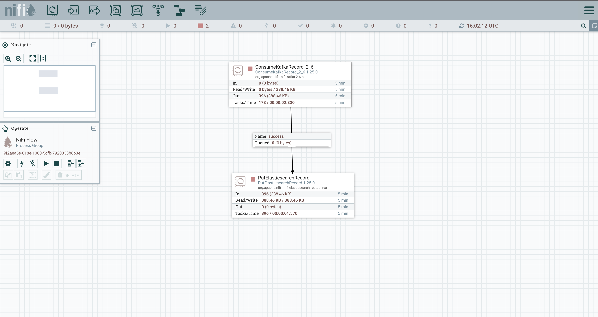
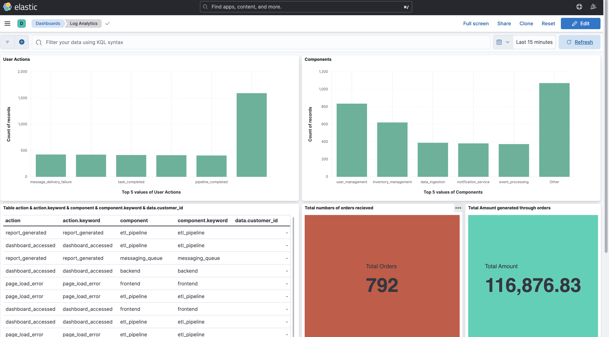
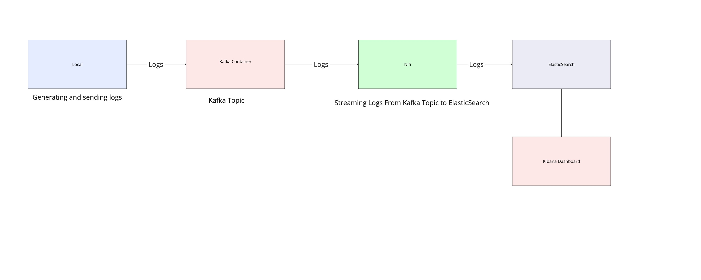

# Log Analytics Pipeline with NiFi, Kafka, Elasticsearch, and Kibana

This repository contains a Dockerized log analytics pipeline using Apache NiFi, Apache Kafka, Elasticsearch, and Kibana. The pipeline enables real-time ingestion, processing, storage, and visualization of log data generated by complex applications.

## Features

- **Real-time Data Ingestion:** Apache NiFi facilitates the ingestion of log data from various sources, allowing seamless integration with existing systems.

- **Scalable Message Streaming:** Apache Kafka provides a scalable and fault-tolerant message streaming platform, ensuring reliable data transfer between components.

- **Efficient Log Storage:** Elasticsearch is used for indexing and storing log data, enabling fast and efficient search and retrieval of log events.

- **Interactive Visualization:** Kibana offers powerful visualization tools to create interactive dashboards and gain insights from log data.

## Getting Started

### Prerequisites

Make sure you have Docker and Docker Compose installed on your system.

### Installation

1. Clone the repository:

```bash
git clone https://github.com/your-username/log-analytics-pipeline.git
```

2. Navigate to the project directory:

```bash
cd log-analytics-pipeline
```

3. Start the Docker containers:

```bash
docker-compose up -d
```

### Usage

1. Access Apache NiFi UI:



```plaintext
http://localhost:8080/nifi
```

2. Use the template named kafka_to_elasticsearch to read data from kafka topic named log(running in the container) and load the to the elasticSearch container in an index named log_level.

3. Access Kibana UI

```plaintext
http://localhost:5601
```

4. You will find a dashboard and named log_analytics , you can use it to analyze log data stored in Elasticsearch.

## LOGS DATA
For generating the logs , i have used Python faker Library .
 You can simply run the main.py script using
 ```bash
 python etl/main.py
 ```
the script will start generating fake logs and send it to kafka topic.

## Architecture


The log analytics pipeline consists of several components working together to ingest, process, store, and visualize log data:

1. **Log Generation:**
   - Fake log data is generated using the Python Faker library. This simulated data mimics real log events generated by various components of a complex application.

2. **Message Streaming:**
   - Apache Kafka serves as the message streaming platform, facilitating the real-time transfer of log data between components. Logs are published to Kafka topics where they can be consumed by downstream applications.

3. **Data Ingestion:**
   - Apache NiFi is responsible for data ingestion, transformation, and routing. It provides a graphical user interface (UI) for designing data flow pipelines. In this pipeline, NiFi consumes log data from Kafka topics, performs any necessary transformations, and sends the data to Elasticsearch for indexing.

4. **Data Storage:**
   - Elasticsearch is used as the data store for log events. It provides scalable and efficient indexing, enabling fast search and retrieval of log data. Log events are indexed in Elasticsearch based on their log level.

5. **Data Visualization:**
   - Kibana serves as the visualization layer for the log analytics pipeline. It offers powerful visualization tools to create interactive dashboards and gain insights from log data stored in Elasticsearch. Users can analyze log events, monitor system performance, and detect anomalies through Kibana dashboards.

By leveraging these components together, the log analytics pipeline enables organizations to efficiently manage and analyze log data, leading to improved system monitoring, troubleshooting, and performance optimization.

Feel free to further customize the architecture section or let me know if you need any additional information!

## Customization

Feel free to customize the NiFi data flow, Kafka topics, Elasticsearch indices, and Kibana dashboards to meet your specific requirements.

## Contributing

Contributions to this project are welcome! Please feel free to open issues, submit pull requests, or suggest improvements.

## License

This project is licensed under the [MIT License](LICENSE).

---

Feel free to make any further adjustments or let me know if there's anything specific you'd like to change!